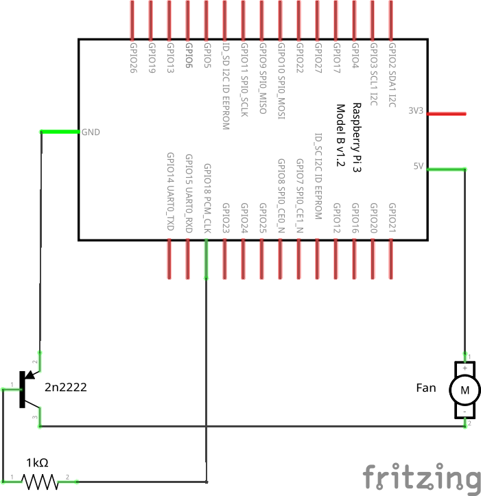

# rpi-fan-controller
A temperature dependant fan controller for the raspberry pi. By default the fan switches on if the CPU is above 40 °C (104 °F) (313.15 K), it checks the temperature every 10 minutes.

## Installation Guide

Open up a terminal and run the following commands:

    git clone https://github.com/IgniparousTempest/rpi-fan-controller
    cd rpi-fan-controller
    chmod u+x ./install.sh
    ./install.sh
    
Once the install script has completed, you can delete the `rpi-fan-controller` folder.

## Circuit

The circuit uses a PNP transistor as a switch, with a 1kΩ resistor on the base. It uses GPIO18/GEN1 as the the trigger by default.

A simple circuit diagram:

Or a nice visual example:

